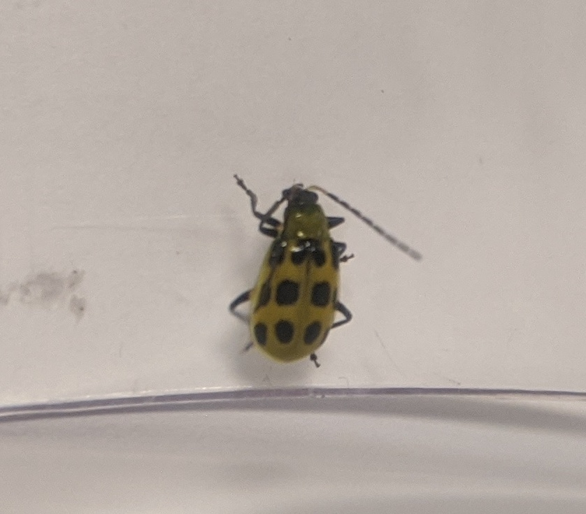
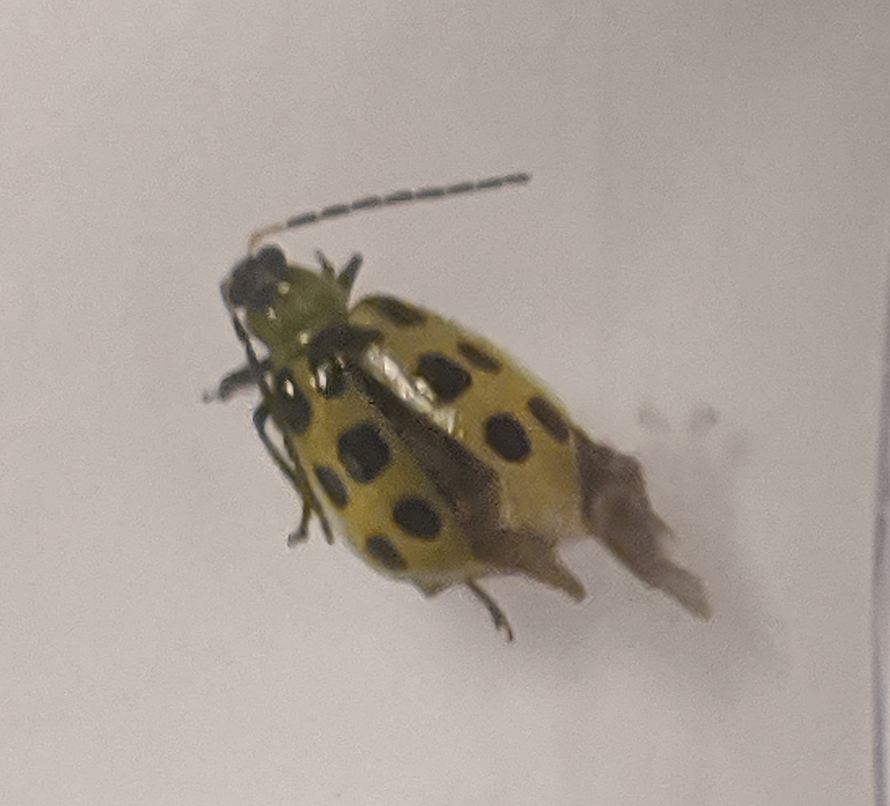

# August 24, 2020
* **Place**: 200 Commonwealth Ave, Chestnut Hill, MA. Near Boston College campus.
* **Time**: 12PM
* **Temperature**: 85F
* **Humidity**: 56%
* **Pressure**: 29.95 in

**Spotted cucumber beetle** (*Diabrotica undecimpunctata*) found feeding on hydrangea (*H. paniculata*?) flowers. Bees and bumblebees were the majority of insects present, with smaller numbers of flies and flower flies.

These are native insects but constitute major agricultural pests. Adults eat plant tissue of cucurbits and may blemish fruit and 
spread *Pseudomonas lachrymans* bacteria (angular leaf spot). 
Larvae live underground and feed on roots and burrow through stems of plants.
([Source](http://entnemdept.ufl.edu/creatures/veg/bean/spotted_cucumber_beetle.htm))
 

The eleven spots (*undecimpunctata*) are visible in these pictures. The center spots at the top row of spots counts as one. 